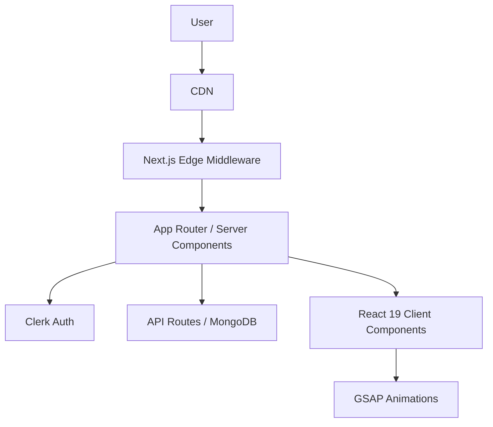

# QuizMaster Pro


**QuizMaster Pro** is a modern, adaptive MCQ quiz platform. It leverages a robust, edge-first architecture with **Next.js 16 (App Router)**, **React 19**, and a clean, accessible UI/UX for seamless learning experiences.

> _Master any subject with confidence through our dual-mode learning engine._

---

## 🚀 Features at a Glance

- **Dual-Mode Learning**: Study Mode (immediate feedback, explanations, unlimited attempts) & Exam Mode (timed, analytics, one attempt per session). Always prompts for mode selection on new quiz start.
- **Sticky ProgressHeader & Timer**: Navigation bar and timer are always visible at the top in exam mode, never scroll out of view.
- **Modern UI/UX**: Aurora backgrounds, glassmorphism, smooth motion (GSAP, Framer Motion), mobile-first responsive design.
- **Adaptive Theming**: System-aware dark/light mode, zero FOUC, theme toggle.
- **Secure Auth**: Clerk (Google OAuth, Magic Links), edge middleware, public/private route control.
- **Type Safety**: End-to-end strict TypeScript 5, all code passes ESLint and strict TS checks.
- **Performance**: Turbopack, edge caching, WebVitals analytics, dynamic SEO metadata, fast cold starts.
- **Accessibility**: WCAG 2.1, keyboard navigation, skip links, ARIA live regions, semantic HTML throughout.
- **Error Handling**: Custom 404, 401, 403, 500 pages with system UI and automatic redirects for protected/admin routes.
- **API-First**: Modular Next.js API routes, MongoDB/Mongoose integration-ready.
- **Admin Panel & Roles**: Clerk organization-based roles—admins (assigned via Clerk dashboard) can add, edit, and delete quizzes; all other users are members with quiz-taking access only.
- **Quiz Types**: Supports both passage-based quizzes (multiple questions per passage) and normal quizzes (single questions).
- **Admin Split View**: Complex quiz creation made easy with a responsive split-view layout (navigation sidebar + editor), real-time validation, and optimistic updates.
- **Focus Mode**: Distraction-free quiz interface with centered typography, sticky passage context, and mobile-optimized navigation drawer.
- **Dynamic Metadata**: All pages use Next.js metadata for SEO (title, description, OpenGraph, Twitter, robots, canonical).

---

## 🏗️ Architecture Overview (2025)

**Domain-Driven Design (DDD)** within Next.js App Directory:



### Directory Structure (Highlights)

```bash
src/
├── app/                      # App Router: routes, layouts, error pages, metadata
│   ├── 401.tsx               # Unauthorized page
│   ├── 403.tsx               # Forbidden page
│   ├── 404.tsx               # Not Found page
│   ├── 500.tsx               # Server Error page
│   ├── layout.tsx            # Root layout, providers
│   ├── page.metadata.ts      # Dynamic SEO metadata
│   ├── page.tsx              # Home page
│   ├── dashboard/            # User dashboard (protected)
│   ├── admin/                # Admin panel
│   │   ├── create-quiz/      # Create quiz page
│   │   │   └── page.tsx
│   │   └── quizzes/          # Admin quizzes list
│   │       └── page.tsx
│   ├── quizzes/              # Quiz selection page
│   │   └── page.tsx
│   ├── quiz/                 # Quiz engine
│   │   └── [quizId]/         # Dynamic quiz pages
│   │       ├── page.metadata.ts
│   │       └── page.tsx
│   ├── api/                  # API routes
│   │   ├── admin/
│   │   │   ├── create-quiz/  # POST admin quiz creation
│   │   │   │   └── route.ts
│   │   │   └── quizzes/      # GET admin quizzes, quizId
│   │   │       ├── route.ts
│   │   │       └── [quizId]/
│   │   │           └── route.ts
│   │   ├── quiz/
│   │   │   └── [quizId]/
│   │   │       ├── attempt/
│   │   │       │   └── route.ts
│   │   │       └── questions/
│   │   │           └── route.ts
│   │   ├── quizzes/
│   │   │   └── route.ts
│   │   └── user/
│   │       └── [userId]/
│   │           └── history/
│   │               └── route.ts
│   ├── sign-in/             # Sign-in route
│   │   └── [[...sign-in]]/
│   │       └── page.tsx
│   ├── sign-up/             # Sign-up route
│   │   └── [[...sign-up]]/
│   │       └── page.tsx
│   ├── _components/         # App-level components
│   │   └── WebVitals.tsx
│   ├── globals.css          # Global styles
│   ├── robots.ts            # robots.txt
│   └── sitemap.ts           # sitemap.xml
├── components/              # UI, quiz, theme, auth, shadcn primitives
│   ├── auth/
│   │   └── ClerkComponents.tsx
│   ├── providers/
│   │   └── theme-provider.tsx
│   ├── quiz/
│   │   ├── ExplanationPanel.tsx
│   │   ├── ModeSelector.tsx
│   │   ├── OptionButton.tsx
│   │   ├── ProgressHeader.tsx
│   │   ├── QuestionCard.tsx
│   │   ├── ScoreSummary.tsx
│   │   └── index.ts
│   ├── theme/
│   │   └── ThemeToggle.tsx
│   └── ui/                  # shadcn/ui primitives
│       ├── alert.tsx
│       ├── aurora-background.tsx
│       ├── badge.tsx
│       ├── button.tsx
│       ├── card.tsx
│       ├── dialog.tsx
│       ├── radio-group.tsx
│       ├── scroll-area.tsx
│       ├── separator.tsx
│       ├── sheet.tsx
│       └── skeleton.tsx
├── hooks/                   # Custom React hooks
│   └── useQuiz.ts
├── lib/                     # Utilities, types, API clients, db, models
│   ├── api.ts
│   ├── mock-data.ts
│   ├── types.ts
│   ├── utils.ts
│   ├── db/
│   │   └── mongodb.ts
│   ├── models/
│   │   ├── Attempt.ts
│   │   ├── Question.ts
│   │   └── Quiz.ts
│   └── utils/
│       ├── admin-server.ts
│       ├── admin.ts
│       └── security.ts
├── proxy.ts                 # Proxy utility
└── scripts/                 # Dev scripts
   └── seed-database.ts
```

---

## 🌐 SEO, Performance & Error Handling

- **Dynamic Metadata**: All pages use Next.js metadata export (no <Head> in pages) for SEO: titles, descriptions, OpenGraph, Twitter, robots, canonical tags.
- **Custom Error Pages**: 404, 401, 403, 500—styled to match system UI, with clear messaging and navigation.
- **Automatic Redirects**: Admin/protected routes use router.replace or window.location.replace to redirect unauthorized/forbidden users to 401/403 pages.
- **WebVitals & Analytics**: Real user metrics and analytics integrated in layout.
- **Accessibility**: Skip links, focus management, ARIA live regions, semantic structure, semantic tags (<main>, <section>, <nav>, <header>, <article>, <aside>, <footer>, <h1>-<h6>).
- **Strict Linting/TypeScript**: All code passes ESLint (Next.js config) and strict TS checks.

---

## 🛠️ Technology Stack

- **[Next.js 16](https://nextjs.org/)** (App Router, Server Components, Edge Middleware)
- **[React 19](https://react.dev/)**
- **[TypeScript 5](https://www.typescriptlang.org/)** (strict mode)
- **[Tailwind CSS v4](https://tailwindcss.com/)**
- **[Shadcn UI](https://ui.shadcn.com/)**
- **[GSAP](https://greensock.com/gsap/)**, **[Framer Motion](https://www.framer.com/motion/)**
- **[Clerk](https://clerk.com/)**
- **[MongoDB](https://mongodb.com/)**, **[Mongoose](https://mongoosejs.com/)**
- **ESLint, Prettier**

---

## 🚦 Getting Started

### Clerk Organization & Roles

- Admins and members are managed via Clerk organizations. Only users set as "admin" in the Clerk dashboard have access to quiz management features (add, edit, delete quizzes).
- All other users are members and can only take quizzes.
- Admins can manage both passage-type and normal-type quizzes.

### Quiz Types

- **Passage Type**: A passage with multiple related questions grouped together.
- **Normal Type**: Standard MCQ quizzes with individual questions.

- Starting a quiz from "Available Quizzes" always clears previous progress and prompts for mode selection (Study or Exam).
- This is achieved by appending `?new=1` to the quiz URL, which resets the quiz state and ensures a fresh attempt.
- Developers: To force a new quiz attempt programmatically, append `?new=1` to the quiz route (e.g., `/quiz/123?new=1`).

### Prerequisites

- Node.js 20+
- npm / yarn / pnpm

### Installation

1. **Clone the repository**
   ```bash
   git clone https://github.com/your-org/quiz-platform.git
   cd quiz-platform
   ```
2. **Install dependencies**
   ```bash
   npm install
   ```
3. **Configure Environment**
   Duplicate `env.example.txt` to `.env.local` and fill in:
   - `NEXT_PUBLIC_CLERK_PUBLISHABLE_KEY`
   - `CLERK_SECRET_KEY`
   - `MONGODB_URI`
   ```bash
   cp env.example.txt .env.local
   ```
4. **Start Development Server**
   ```bash
   npm run dev
   ```
   Access at [http://localhost:3000](http://localhost:3000)

---

## 🧪 Development & Contribution

- **Linting**: `npm run lint` (Next.js + Core Web Vitals)
- **Formatting**: Prettier auto-format on save
- **Commits**: Conventional Commits recommended

### Contribution Workflow

1. Fork the repo
2. Create a feature branch (`git checkout -b feature/amazing-feature`)
3. Commit (`git commit -m 'feat: Add amazing feature'`)
4. Push (`git push origin feature/amazing-feature`)
5. Open a Pull Request

---

## 📄 License

Distributed under the MIT License. See `LICENSE` for details.

---

---

_Documentation maintained by the QuizMaster Pro Engineering Team. Last updated: 2025-12-27._
