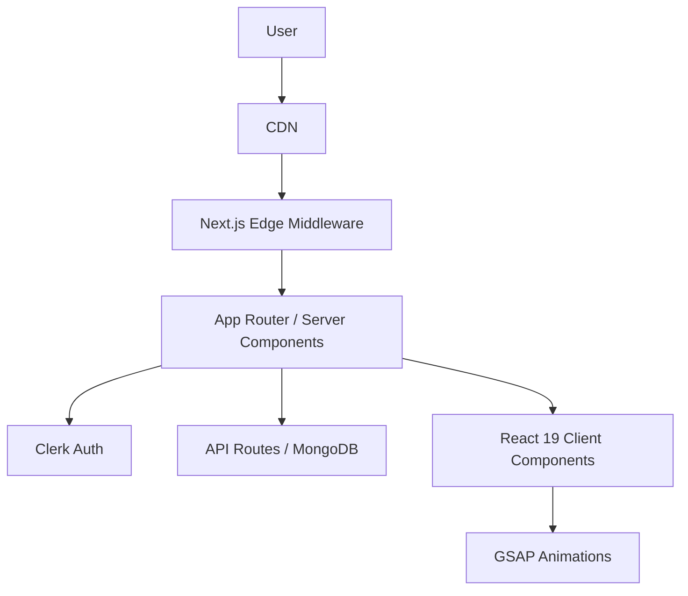

# QuizMaster Pro


**QuizMaster Pro** is a high-performance, adaptive MCQ quiz platform built to FAANG standards. It leverages a modern, edge-first architecture with **Next.js 16 (App Router)**, **React 19**, and a robust UI/UX system for seamless, accessible, and SEO-optimized learning experiences.

> _Master any subject with confidence through our dual-mode learning engine._

---

## 🚀 Features at a Glance

- **Dual-Mode Learning**: Study Mode (immediate feedback, explanations) & Exam Mode (realistic test simulation, analytics).
- **Cinematic UI**: Aurora backgrounds, glassmorphism, and fluid motion via GSAP & Framer Motion.
- **Adaptive Theming**: System-aware dark/light mode, zero FOUC.
- **Enterprise-Grade Auth**: Clerk (Google OAuth, Magic Links), secure edge middleware, public/private route control.
- **Type Safety**: End-to-end strict TypeScript 5.
- **Performance**: Turbopack, edge caching, WebVitals analytics, dynamic SEO metadata.
- **Accessibility**: WCAG 2.1, keyboard navigation, skip links, semantic HTML.
- **Error Handling**: Custom 404, 401, 403, 500 pages with system UI and automatic redirects for protected/admin routes.
- **API-First**: Modular Next.js API routes, MongoDB/Mongoose integration-ready.

---

## 🏗️ Architecture Overview

**Domain-Driven Design (DDD)** within Next.js App Directory:



### Directory Structure

```bash
src/
├── app/                  # App Router: routes, layouts, error pages, metadata
│   ├── 404.tsx           # Not Found (SEO, UI)
│   ├── 401.tsx           # Unauthorized (SEO, UI)
│   ├── 403.tsx           # Forbidden (SEO, UI)
│   ├── 500.tsx           # Server Error (SEO, UI)
│   ├── layout.tsx        # Root layout, ClerkProvider, ThemeProvider, WebVitals
│   ├── page.metadata.ts  # Dynamic SEO metadata
│   ├── dashboard/        # User dashboard (protected)
│   ├── admin/            # Admin panel (protected, redirects to 401/403)
│   ├── quizzes/          # Quiz selection
│   ├── quiz/[quizId]/    # Quiz engine, dynamic metadata
│   └── api/              # API routes (RESTful, edge-ready)
├── components/           # UI, quiz, theme, auth, shadcn primitives
├── lib/                  # Utilities, types, API clients, db, models
├── hooks/                # Custom React hooks (useQuiz, etc.)
└── scripts/              # Dev scripts (e.g., seed-database)
```

---

## 🌐 SEO, Performance & Error Handling

- **Dynamic Metadata**: All pages use Next.js metadata for titles, descriptions, OpenGraph, Twitter, robots, and canonical tags.
- **Custom Error Pages**: 404, 401, 403, 500—styled to match system UI, with clear messaging and navigation.
- **Automatic Redirects**: Admin/protected routes use router.replace or window.location.replace to redirect unauthorized/forbidden users to 401/403 pages.
- **WebVitals & Analytics**: Real user metrics and analytics integrated in layout.
- **Accessibility**: Skip links, focus management, ARIA live regions, semantic structure.
- **Strict Linting/TypeScript**: All code passes ESLint (Next.js config) and strict TS checks.

---

## 🛠️ Technology Stack

- **[Next.js 16](https://nextjs.org/)** (App Router, Server Components, Edge Middleware)
- **[React 19](https://react.dev/)** (Concurrent features, hooks)
- **[TypeScript 5](https://www.typescriptlang.org/)** (strict mode)
- **[Tailwind CSS v4](https://tailwindcss.com/)** (utility-first, optimized config)
- **[Shadcn UI](https://ui.shadcn.com/)** (accessible primitives)
- **[GSAP](https://greensock.com/gsap/)**, **[Framer Motion](https://www.framer.com/motion/)** (animation)
- **[Clerk](https://clerk.com/)** (auth, user management)
- **[MongoDB](https://mongodb.com/)**, **[Mongoose](https://mongoosejs.com/)** (data, models)
- **ESLint, Prettier** (code quality)

---

## 🚦 Getting Started

### Prerequisites

- Node.js 20+
- npm / yarn / pnpm

### Installation

1. **Clone the repository**
   ```bash
   git clone https://github.com/your-org/quiz-platform.git
   cd quiz-platform
   ```
2. **Install dependencies**
   ```bash
   npm install
   ```
3. **Configure Environment**
   Duplicate `.env.example.txt` to `.env.local` and fill in:
   - `NEXT_PUBLIC_CLERK_PUBLISHABLE_KEY`
   - `CLERK_SECRET_KEY`
   - `MONGODB_URI`
   ```bash
   cp env.example.txt .env.local
   ```
4. **Start Development Server**
   ```bash
   npm run dev
   ```
   Access at [http://localhost:3000](http://localhost:3000)

---

## 🧪 Development & Contribution

- **Linting**: `npm run lint` (Next.js + Core Web Vitals)
- **Formatting**: Prettier auto-format on save
- **Commits**: Conventional Commits recommended

### Contribution Workflow

1. Fork the repo
2. Create a feature branch (`git checkout -b feature/amazing-feature`)
3. Commit (`git commit -m 'feat: Add amazing feature'`)
4. Push (`git push origin feature/amazing-feature`)
5. Open a Pull Request

---

## 📄 License

Distributed under the MIT License. See `LICENSE` for details.

---

_Documentation maintained by Engineering Team @ QuizMaster Pro (FAANG Proxy)_
