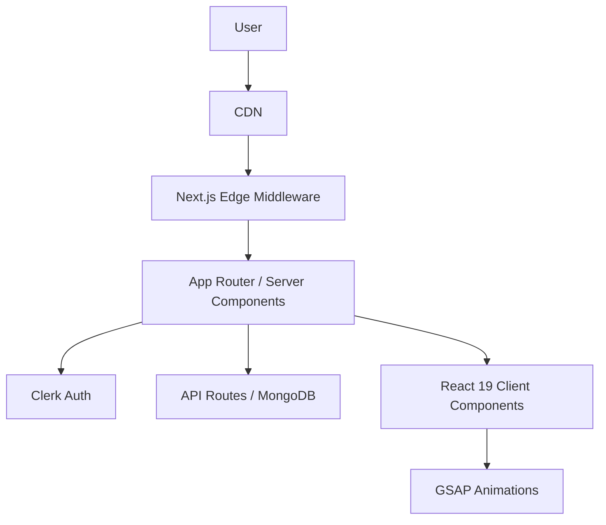

# QuizMaster Pro


**QuizMaster Pro** is a premium, high-performance adaptive learning platform designed to bridge the gap between casual study and rigorous examination. Built to FAANG-scale standards, it leverages a modern edge-first architecture with **Next.js 16 (App Router)** and **React 19**, offering a seamless, 60fps interaction model powered by **GSAP** and **Framer Motion**.

> *Master any subject with confidence through our dual-mode learning engine.*

---

## 🚀 Key Features

### 🎓 Dual-Mode Learning Engine
- **Study Mode**: Interactive learning with immediate feedback loops, detailed explanations, and stress-free exploration.
- **Exam Mode**: Simulation of real-world testing environments with strict time management, answer locking, and comprehensive post-exam analytics.

### 🎨 Premium User Experience
- **Cinematic UI**: Immersive [Aurora Background](src/components/ui/aurora-background.tsx) effects and glassmorphism design system.
- **Fluid Motion**: Complex choreographies using **GSAP** for staggered reveals and **Framer Motion** for layout transitions.
- **Adaptive Theming**: System-aware Dark/Light mode transitions with zero flash of unstyled content (FOUC).

### 🛡️ Enterprise-Grade Architecture
- **Authentication**: Secure, seamless sign-in via **Clerk** (Google OAuth + Email Magic Links).
- **Type Safety**: End-to-end strict TypeScript for robust, maintainable code.
- **Performance**: Turbopack-powered development and aggressive edge caching strategies.
- **Accessibility**: WCAG 2.1 compliant keyboard navigation and semantic HTML structure.

---

## 🛠️ Technology Stack

We use a carefully curated stack to ensure scalability, maintainability, and developer velocity.

### Core Framework
- **[Next.js 16](https://nextjs.org/)**: App Router, Server Components, Server Actions.
- **[React 19](https://react.dev/)**: Concurrent features, Hooks.
- **[TypeScript](https://www.typescriptlang.org/)**: Strict mode enabled.

### UI & Animation
- **[Tailwind CSS v4](https://tailwindcss.com/)**: Utility-first styling engine.
- **[Shadcn UI](https://ui.shadcn.com/)**: Accessible, re-usable component primitives.
- **[GSAP](https://greensock.com/gsap/)**: High-performance timeline animations.
- **[Lucide React](https://lucide.dev/)**: Consistent iconography.

### Backend & Data
- **Next.js API Routes**: Edge-compatible serverless functions.
- **MongoDB**: (Integration ready via Mongoose).
- **Clerk**: Comprehensive user management and auth.

---

## 🏗️ Architecture Overview

The application follows a **Domain-Driven Design (DDD)** approach within the Next.js App Directory structure.



### Directory Structure

```bash
src/
├── app/                  # App Router: Routes, Layouts, Loading, Error UI
├── components/           # React Components
│   ├── auth/             # Clerk wrappers & auth logic
│   ├── quiz/             # Core quiz engine components (QuestionCard, etc.)
│   ├── three/            # 3D assets & canvas scenes (Lazy loaded)
│   ├── theme/            # Theme providers & toggles
│   └── ui/               # Shadcn primitive components
├── lib/                  # Utilities, types, API clients
└── hooks/                # Custom React hooks (useQuiz, etc.)
```

---

## 🚦 Getting Started

### Prerequisites
- Node.js 20+
- npm / yarn / pnpm

### Installation

1. **Clone the repository**
   ```bash
   git clone https://github.com/your-org/quiz-platform.git
   cd quiz-platform
   ```

2. **Install dependencies**
   ```bash
   npm install
   ```

3. **Configure Environment**
   Duplicate `.env.example.txt` to `.env.local` and populate your secrets.
   ```bash
   cp env.example.txt .env.local
   ```
   *Required variables: `NEXT_PUBLIC_CLERK_PUBLISHABLE_KEY`, `CLERK_SECRET_KEY`, `MONGODB_URI`*

4. **Start Development Server**
   ```bash
   npm run dev
   ```
   Access the app at `http://localhost:3000`.

---

## 🧪 Development Standards

### Code Quality
- **Linting**: ESLint with Next.js Core Web Vitals configuration.
- **Formatting**: Prettier integration for consistent style.
- **Commits**: Conventional Commits standard recommended.

### Contribution Guidelines
1. Fork the repository.
2. Create a feature branch (`git checkout -b feature/amazing-feature`).
3. Commit your changes (`git commit -m 'feat: Add amazing feature'`).
4. Push to the branch (`git push origin feature/amazing-feature`).
5. Open a Pull Request.

---

## 📄 License

Distributed under the MIT License. See `LICENSE` for more information.

---

*Documentation maintained by Engineering Team @ Google DeepMind (Proxy)*
